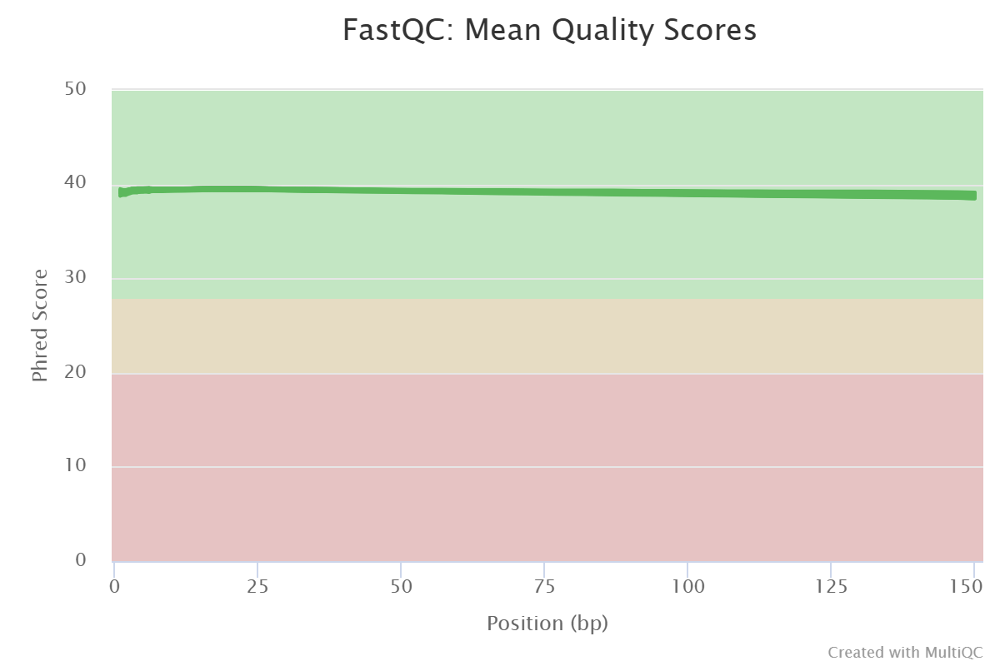
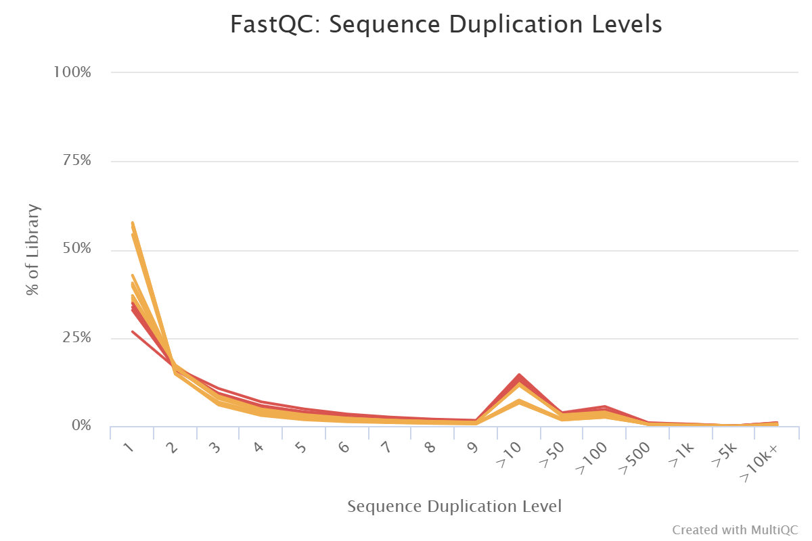
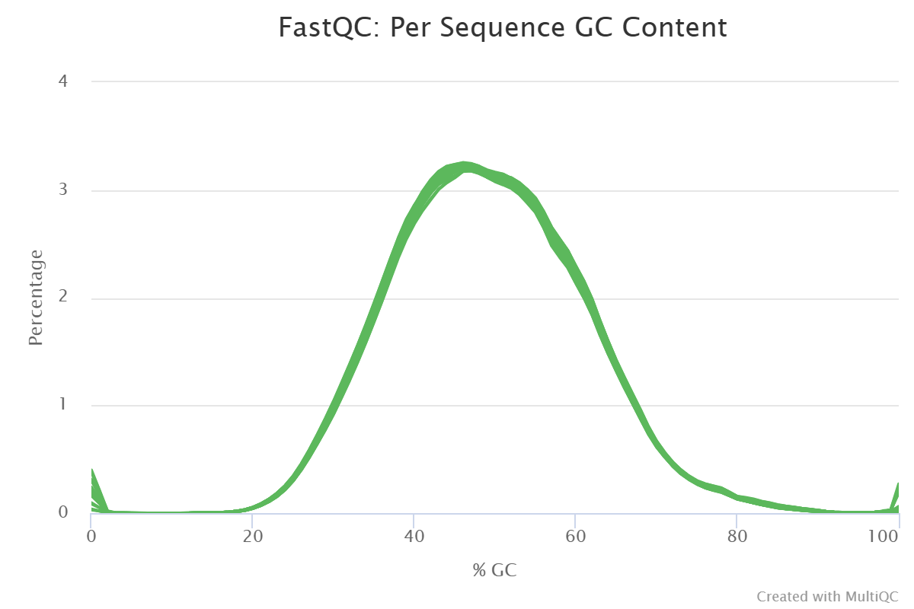
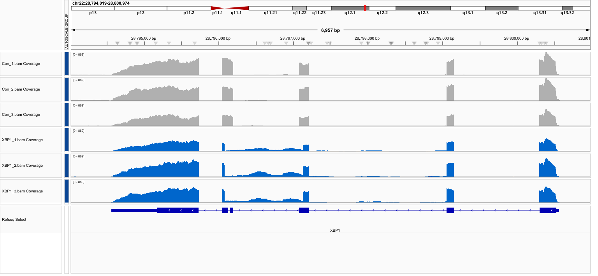
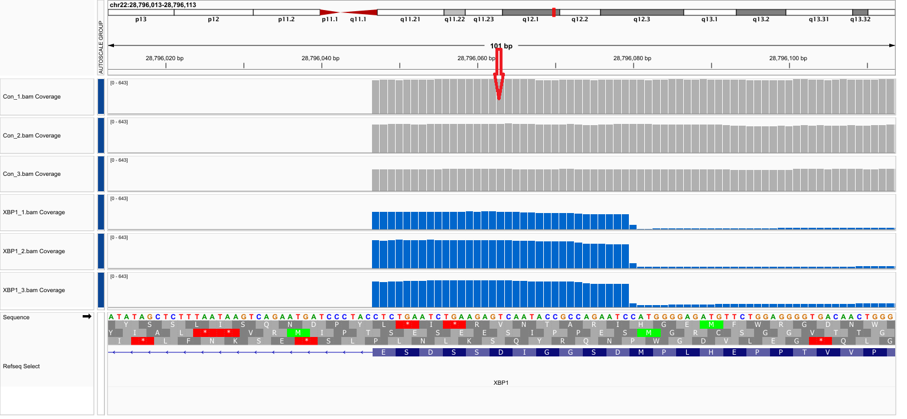
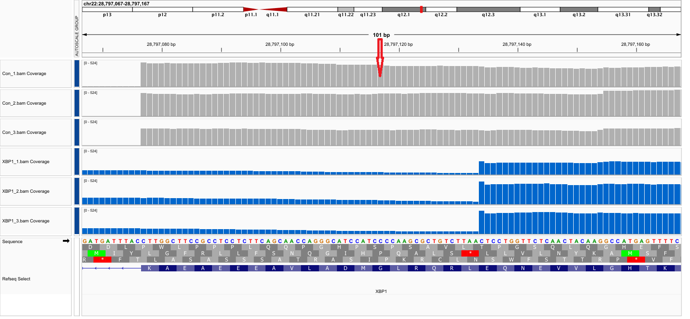

## 1. Project Overview

This project performs a comparative RNA-seq analysis of an in-house dataset generated from human breast cancer cells, using a STAR-based workflow alongside an existing lab pipeline. Four experimental groups were analyzed: Control, Lactate-treated, XBP1 knockout, and XBP1 knockout with lactate. The goal was to assess consistency between pipelines and investigate unexpected expression patterns observed in preliminary analysis.

The workflow includes quality control, alignment, gene-level quantification, differential expression analysis, and downstream visualization such as PCA and heatmaps. In addition, IGV-based inspection was performed as a key step to examine read coverage and validate expression patterns at specific loci. These analyses were used to evaluate sample relationships and identify potential anomalies.

Results confirm that XBP1 disruption occurred.However, the expression patterns suggest a functional knockout rather than a complete genomic deletion. Inspection at the read coverage and transcript level supports this interpretation and highlights the importance of integrating multiple levels of RNA-seq analysis.

## 2. Background and Motivation
XBP1 is a key transcription factor involved in stress response and cancer progression. Knockout of XBP1 is expected to significantly reduce its expression. However, preliminary RNA-seq analysis revealed unexpected expression patterns, motivating further investigation.

## 3. Data and Experimental Design

### 3.1 Dataset Description

The dataset consists of RNA-seq samples from human breast cancer cells (MDA-MB-231) generated in-house under four experimental conditions: Control (Con), Lactate-treated (Lac), XBP1 knockout (XBP1), and XBP1 knockout with lactate treatment (XBP1_L). Each condition includes three biological replicates, resulting in a total of twelve samples.


### 3.2 Project Objectives
The objectives of this project are:

- To implement a STAR-based RNA-seq workflow
- To compare results with an existing lab pipeline
- To investigate unexpected expression patterns in XBP1 knockout samples


## 4. RNA-seq Analysis Workflows

### 4.1 Lab RNA-seq Pipeline

An existing laboratory RNA-seq analysis pipeline was implemented using a Snakemake workflow to ensure reproducibility and scalability across multiple samples.

The pipeline consists of the following steps:

#### 4.1.1 **Quality Control**  

   Raw paired-end sequencing reads were assessed using FastQC to evaluate sequencing quality.

#### 4.1.2 **Read Alignment**  

   Reads were aligned to the human reference genome (GRCh38) using HISAT2, followed by sorting with samtools to generate BAM files.

#### 4.1.3 **Gene Quantification**  

   Aligned reads were quantified at the gene level using featureCounts (Subread package), with gene annotations provided in GFF3 format.

#### 4.1.4 **Count Generation**  

   Gene-level count files for all samples were generated and prepared for downstream analysis.

This pipeline produces gene-level count data, which serves as input for downstream normalization, differential expression analysis, and visualization performed separately in R.

The lab pipeline serves as a benchmark for evaluating the results obtained from the independent STAR-based analysis performed in this project.

### 4.2 STAR-based Workflow

<span style="color:red;">
The code snippets below illustrate key steps of the STAR-based workflow. 
For clarity, only representative commands are shown here. 
The complete pipeline, including all preprocessing and alignment scripts, will be provided separately.
</span>

This STAR-based workflow was implemented on an HPC cluster as an independent analysis pipeline. The workflow includes quality control, genome index generation, read alignment, BAM processing, and gene-level quantification. This independent implementation allows comparison with the lab pipeline and facilitates investigation of unexpected expression patterns observed in XBP1 knockout samples.

Prior to running the full alignment, a test alignment was performed on a single sample to validate the pipeline and parameter settings.

#### 4.2.1 HPC Job Configuration and Environment Setup

All analysis steps were executed on an HPC cluster using SLURM for job scheduling. Each job script specified computational resources, including CPU cores, memory, and runtime, and recorded output and error logs.

```{bash, eval=FALSE}
#SBATCH --job-name=job_name
#SBATCH -N 1
#SBATCH -n 1
#SBATCH -c 8
#SBATCH --mem=32G
#SBATCH --partition=general
#SBATCH --qos=general
#SBATCH --output=log.out
#SBATCH --error=log.err
```

To ensure consistency and reproducibility, common file paths and directories were defined as variables and reused across all steps of the workflow:

```{bash, eval=FALSE}
IN="/home/FCAM/xiqiu/data/yamin_Jan30_2026/01.RawData"
OUT="/home/FCAM/xiqiu/meds5420/final_project/out_star"
INDEX="/home/FCAM/xiqiu/work/indices/star_index_GRCh38_gencode_v47"
GTF="/home/FCAM/xiqiu/work/indices/gencode.v47.nochr.gtf"
SAMPLES="/home/FCAM/xiqiu/meds5420/final_project/list_samples.txt"
```
The GENCODE v47 annotation file (gencode.v47.nochr.gtf) was used for gene quantification. To ensure compatibility with the reference genome used in this workflow, the annotation file was preprocessed by removing the "chr" prefix from chromosome names:
```{bash, eval=FALSE}
sed 's/^chr//' gencode.v47.annotation.gtf > gencode.v47.nochr.gtf
```

This step ensures consistent chromosome naming between the reference genome and annotation file, avoiding mismatches during alignment and read counting.

#### 4.2.2 Quality Control

Quality control of raw sequencing reads was performed using FastQC, followed by MultiQC to summarize results across all samples.

The analysis was executed iteratively using a predefined sample list and shared input directory variables:

```{bash, eval=FALSE}
module load fastqc
module load MultiQC

while IFS= read -r sample; do
    fastqc -t 4 \
    $IN/${sample}/${sample}_*.fq.gz \
    -o fastqc_out
done < "$SAMPLES"

multiqc fastqc_out -o multiqc
```


#### 4.2.3 STAR Genome Index Generation

Before alignment, a genome index was generated using the human reference genome (GRCh38) and GENCODE v47 annotation:

```{bash, eval=FALSE}

module load STAR/2.7.11a

STAR --runThreadN 8 \
--runMode genomeGenerate \
--genomeDir $INDEX \
--genomeFastaFiles Homo_sapiens.GRCh38.dna.primary_assembly.fa \
--sjdbGTFfile $GTF \
--sjdbOverhang 100

```


#### 4.2.4 Read Alignment

Read alignment was performed using STAR in a loop over all samples listed in a sample file. The alignment process included read mapping, BAM file generation, renaming, and indexing for downstream analysis.

```{bash, eval=FALSE}
while IFS= read -r sample; do
    STAR --runThreadN 8 \
    --genomeDir star_index_GRCh38_gencode_v47 \
    --readFilesIn $IN/${sample}/${sample}_1.fq.gz \
                   $IN/${sample}/${sample}_2.fq.gz \
    --readFilesCommand zcat \
    --outFileNamePrefix $OUT/${sample} \
    --outSAMtype BAM SortedByCoordinate \
    --outBAMsortingThreadN 8 \
    --outFilterMultimapNmax 20 \
    --alignIntronMin 20 \
    --alignIntronMax 300000

    if [ $? -eq 0 ]; then
        mv "${OUT}/${sample}Aligned.sortedByCoord.out.bam" "${OUT}/${sample}.bam"
        igvtools index ${OUT}/${sample}.bam
    fi

done < "$SAMPLES"
```

This step generates sorted BAM files for each sample and creates index files required for visualization in IGV.

#### 4.2.5 Gene Quantification

Gene-level read counts were generated using featureCounts from the Subread package. BAM files produced from the STAR alignment step were used as input for quantification.

```{bash, eval=FALSE}

module load subread

featureCounts -T 8 \
-p \
-t exon \
-g gene_id \
--primary \
-a $GTF \
-o counts_star.txt \
$OUT/*.bam
```
The resulting count matrix (`counts_star.txt`) was used as input for downstream normalization and differential expression analysis in R.

## 5. Quality Control

Quality control was performed on the RNA-seq data processed through the STAR-based workflow, using FastQC and summarized with MultiQC.

The summary statistics of sequencing quality across all samples are shown below:


```{r, echo=FALSE, message=FALSE, warning=FALSE}
if (!requireNamespace("readxl", quietly = TRUE)) {
    install.packages("readxl")
}
library(readxl)

if (!requireNamespace("knitr", quietly = TRUE)) {
    install.packages("knitr")
}
library(knitr)
```

```{r, echo=FALSE}
qc_table <- read_excel("figures/MultiQC_summary_table.xlsx")

kable(qc_table, caption = "MultiQC summary of sequencing quality metrics")
```


All samples showed high sequencing quality, with consistent read lengths (150 bp) and stable GC content (~48%). Sequencing depth ranged from approximately 21 to 35 million reads per sample (as shown in the table above).

```{r, echo=FALSE, fig.cap="Per-base sequence quality across all samples", out.width="80%", fig.align="center"}

```

```{r, echo=FALSE, fig.cap="Sequence duplication levels across samples", out.width="80%", fig.align="center"}

```

```{r, echo=FALSE, fig.cap="GC content distribution across samples", out.width="80%", fig.align="center"}

```

These results confirm the overall high quality of the RNA-seq data processed through the STAR-based workflow.

## 6. Data Processing and Differential Expression Analysis

To assess sample relationships, gene-level count data generated from the STAR-based workflow were imported into R and processed using DESeq2.

### 6.1 Read count matrix

```{r setup, quiet=TRUE, echo=TRUE, warning = FALSE,message=FALSE}
options(repos = c(CRAN = "https://cloud.r-project.org"))

if (!requireNamespace("BiocManager", quietly = TRUE))
    install.packages("BiocManager")

if (!require("tximport")) {
  BiocManager::install("tximport")}

if (!require("readr")) {
  install.packages("readr")}

if (!require("ggplot2", quietly = TRUE))
  install.packages("ggplot2")

if (!require("DESeq2", quietly = TRUE))
  BiocManager::install("DESeq2")

if (!require("ggrepel", quietly = TRUE))
  BiocManager::install("ggrepel")

if (!require("clusterProfiler", quietly = TRUE))
  BiocManager::install("clusterProfiler")

if (!require("apeglm", quietly = TRUE))
  BiocManager::install("apeglm")

if (!requireNamespace("tidyverse", quietly = TRUE))
    install.packages("tidyverse")

if (!requireNamespace("vsn", quietly = TRUE))
    BiocManager::install("vsn")

if (!requireNamespace("pheatmap", quietly = TRUE))
    install.packages("pheatmap")

if (!requireNamespace("data.table", quietly = TRUE))
    install.packages("data.table")

if (!requireNamespace("org.Hs.eg.db", quietly = TRUE))
    BiocManager::install("org.Hs.eg.db")

```


```{r lib, quiet=TRUE, echo=TRUE, message=FALSE,warning = FALSE,message=FALSE}
library(tximport)
library(readr)
library(here)
library(DESeq2)
library(ggrepel)
library(tidyverse)
library(clusterProfiler)
library(apeglm)
library(dplyr)
library(vsn)
library(pheatmap)
library(data.table)
library(org.Hs.eg.db)
library(openxlsx)
```

```{r counts, quiet=TRUE, echo=TRUE, message=FALSE}
# Read count matrix generated by featureCounts
counts <- read.table(
  "counts/counts_star.txt",
  header = TRUE,
  sep = "\t",
  comment.char = "#",
  check.names = FALSE
)

rownames(counts) <- counts$Geneid
# Remove annotation columns (first 6 columns)
counts <- counts[,7:ncol(counts)]

# Simplify column names (remove path and .bam suffix)
colnames(counts) <- gsub(".*/", "", colnames(counts))
colnames(counts) <- gsub(".bam", "", colnames(counts))

head(counts)
```

```{r sample_conditions, quiet=TRUE, echo=TRUE, message=FALSE}

# Define sample conditions
condition <- factor(c(
  "Con","Con","Con",
  "Lac","Lac","Lac",
  "XBP1","XBP1","XBP1",
  "XBP1_L","XBP1_L","XBP1_L"
))

# Create metadata table
coldata <- data.frame(
  row.names = colnames(counts),
  condition
)

coldata
```


### 6.2 Build DESeq dataset

```{r DESeq2, quiet=TRUE, echo=TRUE, message=FALSE}
library(DESeq2)

dds <- DESeqDataSetFromMatrix(
  countData = counts,
  colData = coldata,
  design = ~ condition
)
```

Low-count genes were filtered out prior to differential expression analysis. Genes were retained only if they had a count of at least 50 in at least three samples, corresponding to the smallest group size. This step reduces noise and improves the reliability of downstream statistical analysis.
```{r Prefilter, quiet=TRUE, echo=TRUE, message=FALSE}
# Define smallest group size (3 replicates per condition)
smallestGroupSize <- 3

# Keep genes with at least 50 counts in at least 3 samples
keep <- rowSums(counts(dds) >= 50) >= smallestGroupSize

# Inspect filtering results
sum(keep)        # number of genes retained
sum(!keep)       # number of genes removed
table(keep)      # TRUE/FALSE distribution

# Apply filtering
dds <- dds[keep, ]
```

### 6.3 DESeq2 Analysis

After filtering low-count genes, differential expression analysis was performed using the DESeq2 package. This step includes normalization, dispersion estimation, and model fitting.

```{r DESeq, quiet=TRUE, echo=TRUE, message=FALSE}
# Set reference level (Control group as baseline)
dds$condition <- relevel(dds$condition, ref = "Con")

# Run DESeq2 (normalization, dispersion estimation, model fitting)
dds <- DESeq(dds)
```
The default DESeq2 results were inspected to confirm successful model fitting.
```{r , quiet=TRUE, echo=TRUE, message=FALSE}
# Extract default results (last level vs reference)
res <- results(dds)
head(res)
```
While the default DESeq2 results represent the comparison between the last factor level and the reference group, specific contrasts were defined to compare each condition (Lac, XBP1, and XBP1_L) against the control group.
```{r , quiet=TRUE, echo=TRUE, message=FALSE}
res_XBP1 <- results(dds, contrast = c("condition","XBP1","Con"))
res_Lac <- results(dds, contrast = c("condition","Lac","Con"))
res_XBP1L <- results(dds, contrast = c("condition","XBP1_L","Con"))
```

### 6.4 Log fold change shrinkage for visualization and ranking

This section refines differential expression results using shrinkage to reduce noise in low-count genes.Differential expression analysis was performed using DESeq2 with the control group as the reference. Log fold change shrinkage was applied using the apeglm method to improve effect size estimation, particularly for low-count genes. MA plots were generated to assess global expression patterns and the effect of shrinkage.

```{r, quiet=TRUE, echo=TRUE, message=FALSE}
# Show available coefficients
resultsNames(dds)

resLFC_XBP1 <- lfcShrink(dds,
                    coef="condition_XBP1_vs_Con",
                    type="apeglm")

resLFC_XBP1

resLFC_Lac <- lfcShrink(dds,
                        coef="condition_Lac_vs_Con",
                        type="apeglm")
resLFC_Lac

resLFC_XBP1_L <- lfcShrink(dds,
                          coef="condition_XBP1_L_vs_Con",
                          type="apeglm")
resLFC_XBP1_L

```

### 6.5 Visualization

#### 6.5.1 Principal Component Analysis (PCA)

PCA was performed to assess sample clustering across conditions.

```{r PCA, echo=TRUE, message=FALSE}

vsd <- vst(dds, blind = FALSE)

p <- plotPCA(vsd, intgroup = "condition")

p + 
  theme_bw() +                     
  theme(
    panel.grid = element_blank(),  
    panel.border = element_rect(color = "black"),
    axis.line = element_line(color = "black")
  )
```
---

PCA showed clear separation of the four groups (PC1: 78%, PC2: 15%). Control (Con) was distinctly separated on the negative PC1. XBP1 group had the highest PC2 values, while XBP1_L was furthest along positive PC1. Lac clustered in the positive PC1/negative PC2 area.

The groups displayed distinct profiles, indicating strong effects of the different conditions.


#### 6.5.2 MA plot

MA plots were generated to visualize log fold changes versus mean expression.

```{r MA_plot, quiet=TRUE, echo=TRUE, message=FALSE}
# XBP1 knockout vs Control
plotMA(
  resLFC_XBP1,
  ylim = c(-2, 2),
  main = "MA Plot: XBP1 KO vs Control"
)

# Lactate-treated vs Control
plotMA(
  resLFC_Lac,
  ylim = c(-2, 2),
  main = "MA Plot: Lactate vs Control"
)

# XBP1 knockout with lactate vs Control
plotMA(
  resLFC_XBP1_L,
  ylim = c(-2, 2),
  main = "MA Plot: XBP1 KO + Lactate vs Control"
)
```
---
Most genes are centered around a log2 fold change of zero across all comparisons, indicating limited overall differential expression. The spread of points increases from XBP1 knockout to lactate-treated and further in the combined condition, suggesting progressively stronger transcriptional effects. XBP1 knockout alone shows a relatively weak global impact, consistent with previous observations.

#### 6.5.3 Volcano Plot

Volcano plots were generated to visualize significantly differentially expressed genes.

```{r Volcano_XBP1, echo=TRUE, message=FALSE}

# -------------------------------
# Parameters
# -------------------------------
gene_id <- "ENSG00000100219"
p_cutoff <- 0.05
fc_cutoff <- 1

# -------------------------------
# Data preparation
# -------------------------------
gene_ids_clean <- sub("\\..*", "", rownames(resLFC_XBP1))
logP <- -log10(resLFC_XBP1$pvalue)

# -------------------------------
# Base plot (with subtitle)
# -------------------------------
plot(resLFC_XBP1$log2FoldChange,
     logP,
     pch = 16,
     cex = 0.6,
     col = "grey",
     xlab = "log2 Fold Change",
     ylab = "-log10(p-value)",
     main = "Volcano Plot: XBP1 vs Control\n(p < 0.05 & |log2FC| > 1)")

# -------------------------------
# Threshold lines
# -------------------------------
abline(h = -log10(p_cutoff), col = "blue", lty = 2)
abline(v = c(-fc_cutoff, fc_cutoff), col = "blue", lty = 2)

# -------------------------------
# Add X-axis labels for thresholds
# -------------------------------
axis(1, at = c(-1, 1), labels = c("-1", "1"))

# -------------------------------
# Add threshold labels
# -------------------------------
text(x = max(resLFC_XBP1$log2FoldChange, na.rm = TRUE) * 0.85,
     y = -log10(p_cutoff),
     labels = "p = 0.05",
     col = "blue",
     pos = 3)

# -------------------------------
# Highlight significant genes
# -------------------------------
sig_idx <- which(resLFC_XBP1$pvalue < p_cutoff &
                 abs(resLFC_XBP1$log2FoldChange) > fc_cutoff)

points(resLFC_XBP1$log2FoldChange[sig_idx],
       logP[sig_idx],
       col = "red",
       pch = 16,
       cex = 0.6)

# -------------------------------
# Highlight XBP1
# -------------------------------
idx <- which(gene_ids_clean == gene_id)

if (length(idx) > 0) {
  points(resLFC_XBP1$log2FoldChange[idx],
         logP[idx],
         col = "darkgreen",
         pch = 19,
         cex = 1.3)

  text(resLFC_XBP1$log2FoldChange[idx],
       logP[idx],
       labels = "XBP1",
       pos = 3,
       col = "darkgreen")
}

# -------------------------------
# Legend (move further right)
# -------------------------------
legend("topright",
       inset = c(-0.05, 0),   # push right
       xpd = TRUE,
       legend = c("Non-significant genes",
                  "Significant genes",
                  "XBP1"),
       col = c("grey", "red", "darkgreen"),
       pch = c(16, 16, 19),
       pt.cex = c(0.6, 0.6, 1.3),
       bty = "n")

```
---
The volcano plot shows that a subset of genes is significantly differentially expressed, as indicated by points exceeding both the p-value threshold (p < 0.05) and fold change cutoff (|log2FC| > 1).

However, XBP1 (highlighted in green) is located near the center of the plot, with a log2 fold change close to zero and a low -log10(p-value). This indicates that XBP1 does not exhibit significant differential expression between knockout and control samples.

This result is unexpected given the knockout design and suggests that XBP1 transcript abundance is not substantially reduced at the RNA-seq level. This observation motivates further validation through cross-pipeline comparison and IGV analysis to determine whether the knockout is functional rather than a complete loss of transcription.


#### 6.5.4 Heatmap
```{r Heatmap, quiet=TRUE, echo=TRUE, message=FALSE}
library(pheatmap)

sampleDists <- dist(t(assay(vsd)))
pheatmap(as.matrix(sampleDists))
```
---
The heatmap shows that biological replicates cluster closely together, indicating good data consistency. Different conditions form distinct groups, suggesting clear transcriptional differences. XBP1 knockout samples do not separate strongly from control samples, consistent with previous analyses.

```{r , quiet=TRUE, echo=TRUE, message=FALSE}
# Save original IDs
res_df <- as.data.frame(res_XBP1)
res_df$gene_id_full <- rownames(res_df)
```


## 7. Comparison with Lab Pipeline


### 7.1 TPM Expression Analysis

To facilitate comparison with the lab pipeline, transcript abundance was estimated using TPM (Transcripts Per Million).

TPM values were calculated from raw counts using gene lengths derived from the annotation file. This allows normalization across both sequencing depth and gene length, enabling comparison of expression levels between samples.


```{r TPM_calculation, message=FALSE, warning=FALSE}

library(data.table)

# Step 1: Read featureCounts output (must include Length column)
counts_full <- fread("counts/counts_star.txt")

# Step 2: Extract gene length
gene_length <- counts_full$Length
names(gene_length) <- counts_full$Geneid

# Step 3: Extract count matrix (remove first 6 annotation columns)
counts_mat <- as.matrix(counts_full[, 7:ncol(counts_full)])

# Step 4: Clean column names
colnames(counts_mat) <- gsub(".*/", "", colnames(counts_mat))
colnames(counts_mat) <- gsub(".bam", "", colnames(counts_mat))

# Step 5: Set rownames
rownames(counts_mat) <- counts_full$Geneid

# Step 6: Match gene length to counts
gene_length <- gene_length[rownames(counts_mat)]

# Convert length to kilobases
gene_length_kb <- gene_length / 1000

# Step 7: Calculate RPK (Reads Per Kilobase)
rpk <- counts_mat / gene_length_kb

# Step 8: Calculate scaling factor per sample
scaling_factor <- colSums(rpk) / 1e6

# Step 9: Calculate TPM
tpm <- sweep(rpk, 2, scaling_factor, "/")

# Step 10: Convert to data.table
tpm_dt <- as.data.table(tpm, keep.rownames = "ensembl_gene_id")

# remove version number
tpm_dt[, ensembl_gene_id := sub("\\..*", "", ensembl_gene_id)]

tpm_dt[, hgnc_symbol := mapIds(
  org.Hs.eg.db,
  keys = ensembl_gene_id,
  column = "SYMBOL",
  keytype = "ENSEMBL",
  multiVals = "first"
)]

setcolorder(tpm_dt, c("ensembl_gene_id","hgnc_symbol",
                      setdiff(names(tpm_dt), c("ensembl_gene_id","hgnc_symbol"))))

# Preview
head(tpm_dt)

# Save as Excel

write.xlsx(tpm_dt, "Final_Project_TPM_expression_matrix.xlsx",asTable=TRUE)
```

### 7.2 Differential Expression Results

To facilitate comparison with the lab pipeline, differential expression results from DESeq2 were combined into a single table. 

Three pairwise comparisons were included:

- Lactate vs Control (Lac vs Con)
- XBP1 knockout vs Control (XBP1 vs Con)
- XBP1 knockout with lactate vs Control (XBP1_L vs Con)

For each comparison, the following statistics were reported:

- Base mean expression (baseMean)
- Log2 fold change (log2FoldChange)
- Raw p-value (pvalue)
- Adjusted p-value (padj)


```{r combine_results, message=FALSE, warning=FALSE}

library(data.table)

# Convert DESeq2 results to data.table
dt_Lac  <- as.data.table(res_Lac, keep.rownames = "ensembl_gene_id")
dt_XBP1 <- as.data.table(res_XBP1, keep.rownames = "ensembl_gene_id")
dt_XBP1L <- as.data.table(res_XBP1L, keep.rownames = "ensembl_gene_id")

# Rename columns
setnames(dt_Lac,
         c("baseMean","log2FoldChange","pvalue","padj"),
         c("Lac_vs_Con.baseMean",
           "Lac_vs_Con.log2FoldChange",
           "Lac_vs_Con.pvalue",
           "Lac_vs_Con.padj"))

setnames(dt_XBP1,
         c("baseMean","log2FoldChange","pvalue","padj"),
         c("XBP1_vs_Con.baseMean",
           "XBP1_vs_Con.log2FoldChange",
           "XBP1_vs_Con.pvalue",
           "XBP1_vs_Con.padj"))

setnames(dt_XBP1L,
         c("baseMean","log2FoldChange","pvalue","padj"),
         c("XBP1_L_vs_Con.baseMean",
           "XBP1_L_vs_Con.log2FoldChange",
           "XBP1_L_vs_Con.pvalue",
           "XBP1_L_vs_Con.padj"))

# Keep only necessary columns
dt_Lac  <- dt_Lac[, .(ensembl_gene_id,
                      Lac_vs_Con.baseMean,
                      Lac_vs_Con.log2FoldChange,
                      Lac_vs_Con.pvalue,
                      Lac_vs_Con.padj)]

dt_XBP1 <- dt_XBP1[, .(ensembl_gene_id,
                       XBP1_vs_Con.baseMean,
                       XBP1_vs_Con.log2FoldChange,
                       XBP1_vs_Con.pvalue,
                       XBP1_vs_Con.padj)]

dt_XBP1L <- dt_XBP1L[, .(ensembl_gene_id,
                         XBP1_L_vs_Con.baseMean,
                         XBP1_L_vs_Con.log2FoldChange,
                         XBP1_L_vs_Con.pvalue,
                         XBP1_L_vs_Con.padj)]

# Merge all results
dt_final <- merge(dt_Lac, dt_XBP1, by="ensembl_gene_id")
dt_final <- merge(dt_final, dt_XBP1L, by="ensembl_gene_id")

# Remove version number from Ensembl IDs (optional but recommended)
dt_final[, ensembl_gene_id := sub("\\..*", "", ensembl_gene_id)]


dt_final[, hgnc_symbol := mapIds(
  org.Hs.eg.db,
  keys = ensembl_gene_id,
  column = "SYMBOL",
  keytype = "ENSEMBL",
  multiVals = "first"
)]

# Reorder columns
setcolorder(dt_final, c("ensembl_gene_id","hgnc_symbol",
                       setdiff(names(dt_final), c("ensembl_gene_id","hgnc_symbol"))))

head(dt_final)

# Save as Excel

write.xlsx(dt_final, "Final_Project_DE_results.xlsx",asTable=TRUE)

```

### 7.3 XBP1 Expression

Expression of XBP1 was examined to evaluate knockout efficiency.

```{r XPB1 Expression, quiet=TRUE, echo=TRUE, message=FALSE}

# Remove version for analysis
rownames(dds) <- sub("\\..*", "", rownames(dds))

plotCounts(dds,
           gene = "ENSG00000100219",
           intgroup = "condition",
           main = "XBP1 Expression Across Four Groups (STAR-based Pipeline)")

```
---
XBP1 expression is lower in knockout samples compared to control, but remains clearly detectable. This suggests that the knockout does not lead to complete loss of XBP1 transcript abundance.


### 7.4 Cross-pipeline Comparison of XBP1 Results

The STAR-based workflow results were compared with the lab pipeline results to evaluate whether the unexpected XBP1 expression pattern was caused by technical or programming issues in the lab pipeline.

```{r pipeline_comparison_xbp1, echo=TRUE, message=FALSE, warning=FALSE}
library(readxl)
library(data.table)
library(ggplot2)
library(knitr)

# Read STAR-based project results
star_tpm <- as.data.table(read_excel("Final_Project_TPM_expression_matrix.xlsx"))
star_de  <- as.data.table(read_excel("Final_Project_DE_results.xlsx"))

# Read lab pipeline results
lab_tpm <- as.data.table(read_excel("data/Lab_Pipeline_tpm_matrix_20260313_1034.xlsx"))
lab_de  <- as.data.table(read_excel("data/Lab_Pipeline_DE_Results_20260313_1034.xlsx"))

# XBP1 Ensembl ID
xbp1_id <- "ENSG00000100219"

# Extract XBP1 TPM values
star_xbp1_tpm <- star_tpm[ensembl_gene_id == xbp1_id]
lab_xbp1_tpm  <- lab_tpm[ensembl_gene_id == xbp1_id]

# Combine XBP1 TPM values for display
xbp1_tpm_compare <- rbind(
  data.table(Pipeline = "STAR-based workflow", star_xbp1_tpm),
  data.table(Pipeline = "Lab pipeline", lab_xbp1_tpm),
  fill = TRUE
)

kable(xbp1_tpm_compare,
      caption = "Comparison of XBP1 TPM values between STAR-based workflow and lab pipeline")

# Compare XBP1-related TPM values across samples
sample_cols <- c("Con_1","Con_2","Con_3",
                 "Lac_1","Lac_2","Lac_3",
                 "XBP1_1","XBP1_2","XBP1_3",
                 "XBP1_L_1","XBP1_L_2","XBP1_L_3")

xbp1_tpm_long <- data.table(
  Sample = sample_cols,
  STAR_TPM = as.numeric(star_xbp1_tpm[, ..sample_cols]),
  Lab_TPM  = as.numeric(lab_xbp1_tpm[, ..sample_cols])
)

# Correlation of XBP1 TPM values between pipelines
cor_xbp1_tpm <- cor(xbp1_tpm_long$STAR_TPM,
                    xbp1_tpm_long$Lab_TPM,
                    use = "complete.obs")

cor_xbp1_tpm

# Scatter plot of XBP1 TPM values
ggplot(xbp1_tpm_long, aes(x = Lab_TPM, y = STAR_TPM, label = Sample)) +
  geom_point(size = 3) +
  geom_text_repel(
  size = 3,
  box.padding = 0.5,
  point.padding = 0.3,
  max.overlaps = Inf
)+
  geom_smooth(method = "lm", se = FALSE) +
  theme_classic() +
  labs(title = "Cross-pipeline Comparison of XBP1 TPM",
       subtitle = paste0("Correlation = ", round(cor_xbp1_tpm, 3)),
       x = "Lab pipeline TPM",
       y = "STAR-based workflow TPM")

# Extract XBP1 DE results
star_xbp1_de <- star_de[ensembl_gene_id == xbp1_id]
lab_xbp1_de  <- lab_de[ensembl_gene_id == xbp1_id]

xbp1_de_compare <- rbind(
  data.table(Pipeline = "STAR-based workflow", star_xbp1_de),
  data.table(Pipeline = "Lab pipeline", lab_xbp1_de),
  fill = TRUE
)

kable(xbp1_de_compare,
      caption = "Comparison of XBP1 differential expression results between pipelines")

```
The comparison between the STAR-based workflow and the lab pipeline shows a very high correlation in XBP1 TPM values (r ≈ 0.996), with data points closely aligned along the fitted line.

This strong agreement indicates that both pipelines produce highly consistent quantification results. Therefore, the observed residual expression of XBP1 in knockout samples is unlikely to be caused by technical or programming errors.

Instead, the results suggest that the incomplete reduction of XBP1 expression reflects a biological outcome rather than a computational artifact.


## 8. IGV-based Validation of XBP1 Knockout


### 8.1 Experimental Design and Target Sites

The XBP1 locus on chromosome 22 was targeted using a CRISPR/Cas9 strategy with two guide RNAs:

- gRNA1: CAATACCGCCAGAATCCATG (chr22:28796063)  
- gRNA2: CCAAGCGCTGTCTTAACTCC (chr22:28797117)  

These sites fall within the region chr22:28796000–28798000 (hg38), which was examined using IGV.


### 8.2 IGV Visualization

#### 8.2.1 Global Coverage of the XBP1 Locus

This section presents the overall read coverage across the XBP1 gene locus in all samples.

```{r, echo=FALSE, fig.cap="Global coverage of the XBP1 locus in control and XBP1 knockout samples", out.width="100%", fig.align="center"}

```

Across all CON and xbp1 knockout samples, continuous read coverage was observed over the XBP1 locus, with no evidence of large deletions.


Across these samples, continuous read coverage was observed over the XBP1 locus, including both CRISPR target sites. No large deletions or complete loss of signal were detected.

Junction tracks showed similar splicing patterns between control and knockout samples, with no obvious disruption of exon connectivity.

At higher resolution, aligned reads in knockout samples still span the target regions, further indicating that the genomic structure remains largely intact.


#### 8.2.2 Local Analysis of CRISPR Cut Site 1 (Exon 5)
Read Alignment around CRISPR Cut Site 1 (chr22:28796063, ±50 bp; i.e., chr22:28796013-28796113)

```{r, echo=FALSE, fig.cap="Cut1 Coverage Figure", out.width="100%", fig.align="center"}

```

The red arrow indicates the first CRISPR cut site at chr22:28796063, located within exon 5. In knockout samples, read coverage shows a clear decrease on the right side of this position, corresponding to the upstream region of XBP1 because the gene is on the negative strand. This suggests local disruption of transcript coverage near the target site.

#### 8.2.3 Local Analysis of CRISPR Cut Site 2 (Exon 4)
Read Alignment around CRISPR Cut Site 2 (chr22:28797117, ±50 bp; i.e., chr22:28797067-28797167)
```{r, echo=FALSE, fig.cap="Cut2 Coverage Figure", out.width="100%", fig.align="center"}

```
The red arrow marks the second CRISPR cut site at chr22:28797117,located within exon 3. In knockout samples, read coverage shows a clear disruption around this position, with reduced signal on one side of the site compared to controls.

This pattern indicates that CRISPR editing has locally affected the XBP1 locus at exon 3. However, read coverage is still present across the region, suggesting that the genomic disruption is partial rather than a complete deletion.

### 8.3 Integration with RNA-seq Results

IGV analysis shows continuous read coverage across the XBP1 locus in all xbp1 knockout samples, indicating the absence of large genomic deletions.

At both CRISPR target sites, localized disruptions in coverage are observed in knockout samples, consistent with partial editing.

These results suggest that specific exonic regions are affected, while the overall gene structure remains intact.

### 8.4 Interpretation of XBP1 Knockout

The IGV analysis indicates that CRISPR editing did not result in complete disruption of the XBP1 locus. Instead, the data are consistent with incomplete editing or the presence of unedited alleles.

Notably, the CRISPR target sites are located within specific exons (exon 5 and exon 3), while the remaining exonic regions retain read coverage. As RNA-seq quantification is performed at the gene level, reads mapping to unaffected exons can still contribute to the overall expression signal.

Therefore, the modest reduction in XBP1 expression observed in RNA-seq data likely reflects partial disruption of the gene rather than complete loss of transcription. The phenotype is thus more consistent with a partial knockdown than a complete knockout.

In addition, residual or truncated transcripts may still be captured by RNA-seq, further contributing to the observed expression levels.

### 8.5 Additional Evidence (RT-PCR)

RT-PCR results show a near-complete loss of XBP1 signal in knockout samples, in contrast to the RNA-seq findings.

This discrepancy likely reflects differences in measurement principles: RNA-seq captures all transcripts mapped to the gene locus, including partial or nonfunctional RNA, whereas RT-PCR specifically detects intact functional transcripts.

Therefore, RNA-seq may overestimate residual expression at the gene level.

```{r, echo=FALSE, fig.cap="RT-PCR analysis showing near-complete loss of XBP1 expression", out.width="100%", fig.align="center"}

```


## 9. Summary and Conclusions

The main goal of this project was to determine whether the XBP1 knockout samples are reliable for downstream laboratory studies.

RNA-seq analysis showed only a modest reduction in gene-level XBP1 expression. However, cross-pipeline comparison confirmed that this pattern was reproducible and was not caused by computational or pipeline errors. IGV analysis further showed localized disruption at the CRISPR target sites, while RT-PCR demonstrated near-complete loss of functional XBP1 transcript signal.

Together, these results suggest that the XBP1 knockout samples can be used for downstream studies focused on functional loss of XBP1. However, RNA-seq gene-level expression should be interpreted carefully, because residual reads may come from partial, truncated, or nonfunctional transcripts.

Therefore, these samples are suitable for follow-up experiments, but conclusions should be based on functional validation rather than gene-level RNA-seq TPM alone.
